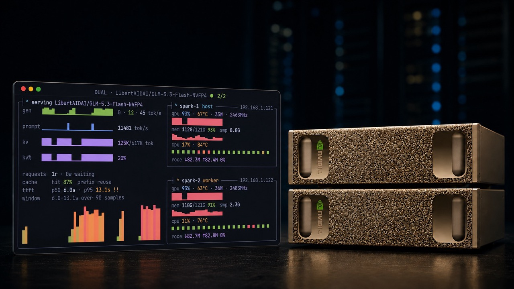

# dgx-top

<p align="center">
  
</p>

[](https://github.com/justincasey/dgx-top/actions/workflows/ci.yml)

`dgx-top` is an agentless terminal dashboard for monitoring one- or two-node NVIDIA DGX Spark clusters running vLLM. It combines hardware telemetry collected over SSH with vLLM's HTTP metrics—nothing is installed on the Spark nodes.

## What it shows

- Prompt and generated token throughput as separate time series
- Prompt-to-generation ratio
- Running and waiting requests
- KV-cache utilization, block-allocated token capacity, and prefix-cache hit rate
- Time-to-first-token p50–p95, with the tail taking warn past 2s and an `!!`
  alarm past 8s
- GPU utilization, temperature, SM clock, memory, and power draw
- CPU utilization, temperature, and per-core activity
- Memory-pressure and thrashing risk from Linux PSI, swap, reclaim, and fault counters
- InfiniBand/RoCE link state and throughput (RX/TX rates and wire utilization) derived from sysfs without requiring `ibstat`

## Requirements

**Control machine**

- macOS or Linux
- Python 3.9 or newer
- OpenSSH client
- Network access to each configured vLLM HTTP endpoint

**Each DGX Spark node**

- Passwordless SSH public-key authentication
- `nvidia-smi`
- Read access to `/proc` and `/sys`
- A running vLLM server exposing `/metrics`

`dgx-top` never needs an SSH password, private key contents, sudo credentials, or an API token in its configuration.

## Quick start

Run from source — no global or tool install needed. `uv` is the only extra
requirement besides Python 3.9+ and an OpenSSH client; `uv sync` installs the
project and its dependencies into a local `.venv`.

```bash
uv sync
uv run dgx-top init      # writes ~/.config/dgx-top/config.toml (mode 0600)
```

Edit the SSH targets and vLLM URLs in `~/.config/dgx-top/config.toml`, then
validate access and launch:

```bash
uv run dgx-top check
uv run dgx-top
```

## Passwordless SSH

If SSH keys are not configured yet:

```bash
ssh-keygen -t ed25519
ssh-copy-id spark@YOUR_SPARK_HOST
ssh spark@YOUR_SPARK_HOST true
```

The final command must complete without asking for a password. `dgx-top check` uses `BatchMode=yes`, so password prompts fail safely instead of hanging the dashboard.

### Using SSH aliases

Aliases keep usernames, hostnames, ports, jump hosts, and identity-file choices in your normal OpenSSH configuration rather than in dgx-top:

```sshconfig
# ~/.ssh/config
Host spark-primary
    HostName spark01.example.com
    User spark
    IdentityFile ~/.ssh/id_ed25519

Host spark-worker
    HostName spark02.example.com
    User spark
    IdentityFile ~/.ssh/id_ed25519
```

Test each alias before continuing:

```bash
ssh spark-primary true
ssh spark-worker true
```

## Configuration

`dgx-top init` creates this structure:

```toml
[app]
poll_interval = 5
history_length = 40
# theme = "dgx-aeon"  # default; any name from `dgx-top themes` works

[[nodes]]
label = "spark-1"
ssh_target = "spark-primary"
vllm_url = "http://spark01.example.com:8000"
worker = false

[[nodes]]
label = "spark-2"
ssh_target = "spark-worker"
vllm_url = "http://spark02.example.com:8000"
worker = true
```

| Setting          | Meaning                                                                     |
| ---------------- | --------------------------------------------------------------------------- |
| `label`          | Short unique name shown in the dashboard                                    |
| `ssh_target`     | Any target accepted by `ssh`, such as `user@host` or an SSH alias           |
| `vllm_url`       | vLLM base URL reachable from the control machine; do not include `/metrics` |
| `worker`         | Marks a worker node in a tensor-parallel deployment                         |
| `poll_interval`  | Initial polling interval in seconds, from 1 to 60                           |
| `history_length` | Number of samples retained in memory, from 10 to 1000                       |
| `theme`          | Color theme name; see [Themes](#themes)                                    |
| `meter_treatment`| Style for the GPU / memory / KV% meters: `gradient` (default), `spark`, `tick`, or `line` |
| `quiet`          | Calm the whole UI: identity hues render neutral; colour appears only on caution/critical |

The SSH target and vLLM URL are intentionally separate. An SSH alias can resolve through `~/.ssh/config`, while HTTP clients generally cannot use that alias.

To use a different file:

```bash
dgx-top --config /path/to/config.toml check
dgx-top --config /path/to/config.toml
```
Or set `DGX_TOP_CONFIG`.

## Themes

The dashboard is themed with Textual's native theme system. Set the theme in the
configuration file:

```toml
[app]
theme = "tokyo-night"
```

or override it on the command line:

```bash
dgx-top --theme tokyo-night-storm
```

Every Textual built-in theme is supported out of the box — including the full
Tokyo Night family — plus the AEON dashboard themes `dgx-aeon` (the default)
and the classic `dgx-dark`:

- **Dark:** `dgx-aeon` (default), `dgx-dark`, `tokyo-night`, `tokyo-night-storm`,
  `nord`, `gruvbox`, `dracula`, `monokai`, `catppuccin-mocha`,
  `catppuccin-macchiato`, `catppuccin-frappe`, `rose-pine`, `rose-pine-moon`,
  `solarized-dark`, `atom-one-dark`, `textual-dark`, `flexoki`, `ansi-dark`
- **Light:** `tokyo-night-light`, `catppuccin-latte`, `solarized-light`,
  `rose-pine-dawn`, `atom-one-light`, `textual-light`, `ansi-light`

Run `dgx-top themes` for the complete list. An unknown theme name is rejected
with the available options when the configuration is loaded.

### Switching themes while running

Press `t` in the dashboard to open a fuzzy theme picker. Highlighting an entry
previews it live and `enter` keeps it; `escape` restores the previous theme. The
switch is session-only — set `theme` in the configuration file to make it stick.

### Design system

The dashboard renders a **tiling-desktop** language (Tokyo Night
foundation): every panel is a hand-painted box-drawing window on a strict
character grid — no CSS borders. The focused SERVING window uses the **heavy**
charset `┏━┓┃┣┫` (a neon glow rendered in weight); node windows use the
**light** charset `╭─╮│├┤`. Each window's title is inset into the top rule as a
btop-style caret tab, with a right-edge meta tab flush at the corner:

```
╭─┤ ^ worker-node worker ├────────────┤ 192.0.2.11 ├─╮
```

The caret and role are cyan for the host, orange for a worker; the SERVING
title carries the model in magenta, and every window border is dim grey. A
**waybar** rides the top (model/topology · online count). A **lualine** status
bar (`● HEALTHY` mode badge · model · cluster context · tok/s · KV% · keys)
appears only in the most compressed layouts.

The semantic palette maps every theme onto these roles:

| Role | dgx-aeon | Meaning |
| --- | --- | --- |
| `bg` | `#0B0E14` | Canvas; never drawn explicitly |
| `fg` | `#C8D0DA` | Primary text and the values you scan for |
| `dim` | `#6B7484` | Chrome: labels, units, separators, unfocused borders |
| `track` | derived | Meter remainder (`▓`) |
| `panel`/`panel_hi` | derived | Status-bar segment fills |
| `accent` | `#7C5CFF` | Orchestrating identity: KV, RoCE, model |
| `blue` | `#4AA3FF` | GPU utilization |
| `cyan` | `#57D4F0` | Focus borders and the host caret |
| `warn` | `#E8863B` | CPU, worker, and caution |
| `ok` | `#3FD07F` | Health: live dots, MEM %, cache hits |

Utilization meters are btop gradient bars — each `█` cell ramps
green → yellow → orange → red by fill position; identity metrics (KV) keep a
single hue over a dim `▓` track. Alarm state never depends on color alone:
`✗` marks an unreachable node, `!!` a TTFT p95 past 8s and `!` past 2s, and the
value is bold. `dgx-aeon` is the default; `tokyo-night` renders the design's
exact reference hues.

## Preflight checks

`dgx-top check` tests every node concurrently:

1. The SSH target accepts key-based, non-interactive authentication.
2. `nvidia-smi` is available and `/proc/stat` is readable.
3. The configured vLLM `/metrics` endpoint is reachable and contains vLLM metrics.

No collected telemetry or endpoint response body is written to disk.

## Layout and small terminals

The dashboard is fluid in both axes. Width picks the arrangement of the
SERVING window and the one or two node windows:

| Width | Layout |
| --- | --- |
| `>= 96` | **Tiling**: the focused SERVING window (~56%) beside the node column (~44%); node windows stacked with a one-row gap |
| `63`–`95` | SERVING full-width hero on top; the node windows sit side by side (duo) below |
| `< 63` | Single column: SERVING, then each node window, full width |

Height picks how tight it gets. Every candidate tier — `roomy` → `dense` →
`compact` → `rail` → `floor` — has an exact total height for the current width
(calibrated to the real rendered heights), and the densest tier that fits wins,
so the dashboard degrades one step at a time and **never scrolls**
(`overflow-y: hidden`); the floor tier guarantees a fit down to an 8-row
viewport at every width:

| Tier | Look |
| --- | --- |
| `roomy` | Full metric rows, gradient meters, two-row core grid, a five-row SERVING area chart |
| `dense` | The same rows with a four-row chart |
| `compact` | One-letter node labels, fused SERVING rows, a two-row chart |
| `rail` | Waybar hidden, SERVING chart dropped, windows kept |
| `floor` | The never-scroll bottom: each node folds to one fused line, SERVING to four bare rows, no window frames |

**Bounded fill, then breathe.** The fit selector guarantees the natural content
fits; the SERVING window carries a real gradient area chart of the generation
history, and leftover viewport rows frame the dashboard with calm, symmetric
breathing room rather than stretching any panel into a slab. Every metric is
kept at every size — the tiers relocate them (node labels shorten to `g`/`m`/`c`;
the SERVING rows fuse; at the floor each node collapses to a single
`● head g73%64° m62G52% c50%51° r9%` line) but nothing is dropped.

## Controls

| Key | Action              |
| --- | ------------------- |
| `+` | Poll faster         |
| `-` | Poll slower         |
| `r` | Refresh immediately |
| `t` | Open the fuzzy theme picker (see [Themes](#switching-themes-while-running)) |
| `q` | Quit                |

## Troubleshooting

### `Host key verification failed`

Connect once interactively and verify the host fingerprint:

```bash
ssh YOUR_SSH_TARGET true
```

`dgx-top` does not disable SSH host-key verification.

### SSH works interactively but preflight fails

The connection is probably relying on password authentication. Confirm non-interactive access:

```bash
ssh -o BatchMode=yes YOUR_SSH_TARGET true
```

### vLLM metrics fail while SSH passes

The metrics URL is accessed directly from the control machine, not through SSH. Verify it there:

```bash
curl --fail http://YOUR_VLLM_HOST:8000/metrics
```

Check the vLLM bind address, firewall rules, and `vllm_url`.

### A node appears offline

Run `dgx-top check`, then verify `nvidia-smi` and the Linux telemetry files using the same SSH target. A vLLM failure alone does not mark hardware offline.

## Development

```bash
git clone https://github.com/justincasey/dgx-top.git
cd dgx-top
uv sync --extra dev
uv run pytest
uv run ruff check .
uv run ruff format --check .
uv build
```

`uv sync` leaves the `dgx-top` script in `.venv/bin`, which is not on your `PATH`, so always run it
through `uv` while developing:

```bash
uv run dgx-top init   # write ~/.config/dgx-top/config.toml
uv run dgx-top check  # verify SSH, telemetry, and vLLM endpoints
uv run dgx-top        # launch the dashboard
```

See [CONTRIBUTING.md](CONTRIBUTING.md) for the contribution workflow.

## Security and privacy

Configuration files are local and ignored by Git. Do not put passwords, private keys, tokens, private hostnames, or private network addresses in issues, logs, screenshots, examples, or commits. See [SECURITY.md](SECURITY.md) for reporting guidance.

## License

[MIT](LICENSE)
